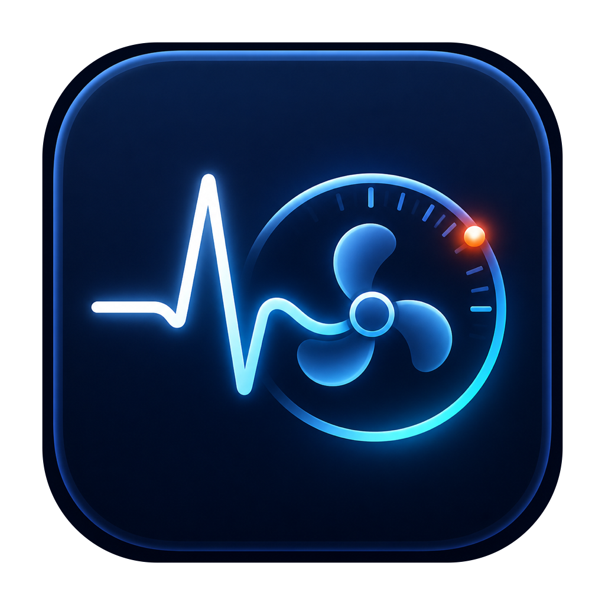

<p align="right">
  简体中文 | <a href="README.md">English</a>
</p>

<p align="center">
  
</p>

<h1 align="center">Mac 资源监控</h1>

<p align="center">系统状态、进程流量、存储管理和 Codex 额度，一个原生 macOS 应用即可查看。</p>

<p align="center">
  
  
  
  
</p>

> 当前版本：**2.6.0（Build 45）**

基于 SwiftUI 构建，采用 Liquid Glass 界面与紧凑菜单栏面板。查看 Mac 资源占用、找出使用带宽的进程、检查已连接接口，并按需分析和清理存储空间。

## 下载与安装

**[下载 MacResourceMonitor-2.6.0.zip](https://github.com/svsvnm/MacResourceMonitor/releases/download/v2.6.0/MacResourceMonitor-2.6.0.zip)** · [发布说明与校验文件](https://github.com/svsvnm/MacResourceMonitor/releases/latest)

需要 **macOS 26 或更高版本，以及 Apple Silicon 芯片**。不支持 Intel Mac 和旧版 macOS。

1. 下载并解压 ZIP。
2. 退出正在运行的旧版，将 **Mac资源监控.app** 拖入“应用程序”；更新时替换旧副本。
3. 从“应用程序”打开。关闭主窗口后菜单栏监控仍会运行；需要结束时，在菜单中选择“退出”。

应用采用 ad-hoc 签名，尚未进行 Apple Developer ID 签名或公证。如果 macOS 阻止打开，请确认来源后，在**系统设置 → 隐私与安全性**中使用对应的允许打开选项，不要关闭系统级安全保护。

如需校验下载完整性，将同名 `.zip.sha256` 文件下载到相同目录，运行：

```zsh
shasum -a 256 -c MacResourceMonitor-2.6.0.zip.sha256
```

## 功能概览

| 模块 | 功能 |
| --- | --- |
| 系统监控 | CPU、内存与历史曲线，网络速度、温度、风扇、电池、电源读数及进程排行 |
| 进程流量 | 按进程展示下载/上传速度、PID，支持搜索、排序及可见监控期间的累计流量 |
| AI 用量 | Codex 订阅剩余额度、可用套餐信息、重置时间与手动刷新 |
| 接口监测 | 可读取的 USB-C、MagSafe、USB4、Thunderbolt、DisplayPort、USB-PD 与线缆 E-Marker 信息 |
| 存储清理 | 目录大小、实际占用超过 500 MB 的大文件、Finder 定位，以及选定的缓存/日志/Xcode/废纸篓清理 |
| 应用卸载 | 按大小列出第三方应用，将选定应用及精确匹配 Bundle ID 的残留移入废纸篓 |

菜单栏弹窗集中展示主要系统指标、**当前有流量的进程 Top 3** 和共享的 Codex 额度摘要。

## 刷新与能耗

- 轻量系统指标约每 **2 秒**刷新。关闭主窗口后，菜单栏标题仍显示 CPU 温度与网络上下行速度。
- 进程流量仅在菜单弹窗或“进程流量”页面可见时采集。两处共用一个采集器，都隐藏后停止采样并清空实时速度。
- 进程排行、风扇、电源和线缆等较重查询，按相关面板的可见状态启停。
- 菜单使用共享显示快照与稳定的内部表面，减少重复界面刷新和玻璃合成。

进程流量通过 macOS `nettop` 读取快照，不安装 VPN 或网络扩展。它**不是完整流量账单**：短连接和界面隐藏期间的流量可能遗漏；不包含本机回环，也不提供域名、请求内容或连接规则视图。

## 使用 Codex 额度监控

1. 在 Codex CLI，或带有可用 CLI 的受支持桌面应用中，登录你的 Codex 订阅账号。
2. 打开侧边栏的 **AI 用量**，或打开菜单栏弹窗。
3. 登录完成或查询失败后，可点击**刷新**重试。

应用内置 **CodexBar CLI v0.56.5**，仅启用 Codex CLI 数据源。额度窗口以账号实际返回的数据为准；缺失数据显示不可用，不会伪装成零。此功能不统计 API 账单，也不会兑换额度重置次数。

任一界面可见时，最多每 **1 分钟**自动查询一次；低电量模式或较高系统温度压力下改为每 **5 分钟**。两处都隐藏后取消查询并停止定时任务。临时失败会标记旧缓存，登录授权失效时会清除缓存。

## 隐私、安全与限制

- 系统和存储数据在本机处理，应用不上传遥测。**Codex 额度是联网功能**，通过你已登录的 Codex CLI 查询；其他模块不需要账号。
- 额度集成不发送对话内容、不导入浏览器 Cookie、不扫描本地费用历史；查询结果仅缓存在内存中。
- 硬件与网络监控只读，不控制风扇、不修改充电策略，也不更改网络配置。
- 清理仅针对界面列出的项目，执行前需要确认，不会自动清理个人文件夹。应用卸载使用废纸篓；**清空废纸篓属于永久删除**。
- 温度、风扇、充电和线缆信息取决于机型与 macOS 开放的数据。USB-PD 协商上限不等于实时充电功率。
- 受保护目录、未索引文件与纯云端文件可能无法统计；不可用读数和不完整扫描会明确提示，不用估算值冒充实测。

## 2.6.0 更新

- 新增 Codex“AI 用量”页面与菜单栏摘要，展示剩余额度和重置时间。
- 加入共享、按可见性启停的额度刷新，限制查询进程运行时间，并区分不可用、旧缓存和登录失效状态。
- 内置固定版本并校验哈希的 CodexBar 组件及依赖许可证，补充离线回归测试。
- 重写中英文 README，聚焦当前功能、安装与安全边界，移除累积的历史更新描述。

历史版本说明保留在 [GitHub Releases](https://github.com/svsvnm/MacResourceMonitor/releases)。

## 构建与测试

需要 Xcode 26 Command Line Tools 或带 macOS 26 SDK 的 Xcode 26。脚本直接调用 Swift 编译器，无需配置 Xcode 工程或包管理器。

```zsh
git clone https://github.com/svsvnm/MacResourceMonitor.git
cd MacResourceMonitor
./build.sh
open "Mac资源监控.app"
```

首次构建会下载固定版本的 arm64 CodexBar 压缩包并校验 SHA-256，后续复用已验证缓存。生成的应用包含所需组件资源和第三方许可证。

运行与 GitHub Actions 相同的检查：

```zsh
./Scripts/ci-check.sh
```

检查涵盖版本一致性、Swift 警告即错误、额度离线回归测试、全新构建、资源、架构与代码签名。正式 Release 的 ZIP 和校验文件由 GitHub Actions 从对应版本标签构建；仓库不提交生成的应用包。

## 第三方组件

- [Stats](https://github.com/exelban/stats)：Apple SMC 访问方式参考。
- [WhatCable](https://github.com/darrylmorley/whatcable)：只读接口与线缆检测。
- [CodexBar](https://github.com/steipete/CodexBar)：通过其 CLI 查询 Codex 订阅额度。

版权和许可证见[第三方声明](THIRD_PARTY_NOTICES.md)与 [CodexBar 依赖许可证](Assets/CodexBarLicenses)。

## 版本信息

- App 版本：2.6.0
- Build：45
- Bundle ID：`io.github.svsvnm.MacResourceMonitor`
- 构建目标：macOS 26.0+，arm64
